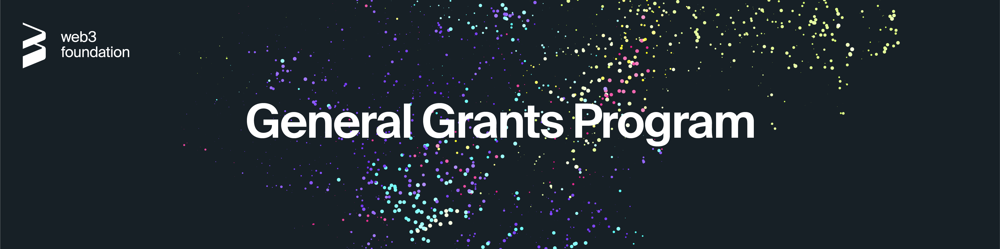

# General Grants Program

  

As part of our commitment to promoting the Web3 ecosystem, we offer a comprehensive grants program focused on funding software development and research efforts related to **Polkadot**, **Kusama** and **Substrate**. 

---

- [:clipboard: About](#clipboard-about)
- [:bookmark_tabs: Guidelines](#bookmark_tabs-guidelines)
  - [Licensing](#licensing)
  - [Documentation](#documentation)
- [:pencil: Process](#pencil-process)
- [:mailbox_with_mail: RFP Suggestion](#mailbox_with_mail-rfp-suggestion)
- [:rocket: Alternative Funding Sources](#rocket-alternative-funding-sources)
  - [Treasury](#treasury)
  - [Open Grants Program](#open-grants-program)
- [:bulb: Help](#bulb-help)
  - [Additional information](#additional-information)
  - [Real-time conversation](#real-time-conversation)
- [:information_source: License](#information_source-license)

## :clipboard: About 
As part of our commitment to promoting the Web3 ecosystem, we offer a comprehensive grants program focused on funding software development and research efforts related to Polkadot and Substrate.
For more information about the Web3 Foundation please visit the [About page](https://web3.foundation/about/) of our website. 

## :bookmark_tabs: Guidelines
Technical grants are intended to fund **Polkadot** and **Substrate** specific projects in the following areas:

* software development
* research

For more specific information on our funding priorities, please view the [Polkadot Stack](./grants/polkadot_stack.md) and take a look at the [accepted grant applications](https://github.com/w3f/Web3-collaboration/blob/master/grants/accepted_grant_applications.md). Additionally the builders program [feedback board](https://feedback.parity.io/) may contain some useful ideas for grant projects.

The funding maximum for technical grants is $100,000 per project.

We ask teams to first consider applying via the [Open Grants Program](https://github.com/w3f/Open-Grants-Program), which supports grants of up to $30,000 and has faster processing times.
If your project has a scope larger than that, we encourage you to split your work into multiple stages, each of $30,000 or less.

Only apply via the General Grants Program if:
* You seek funding of $30,000+ and your work cannot be split into smaller milestones
* You want your team/project information to remain private
* You can only accept fiat payments

Teams shouldn’t seek to cover 100% of their early-stage funding via W3F Grants alone.

Any project requesting :
* **$30k or less** will receive approval the fastest.
* **$31k - 100k** will need to wait longer for a decision.

Teams can apply for grants more than once, but they need to complete the previous project (as described in their application) before receiving additional funds. 

### Licensing
In order to successfully receive grant funding for your application it is necessary for the project to have **open source** code. We prefer Apache 2.0 but the GNU GPL v3 license is also acceptable.

### Documentation
To ensure ease-of-use we require all projects to create documentation that explains how their project works. At a minimum, written documentation is required for funding. Tutorials or videos are also helpful for new users to understand how to use the product.

## :pencil: Process
If you are considering applying for a grant, please follow the process below.
  
1. **Determine the scope of your project**
   * Review the [Polkadot Stack](./grants/polkadot_stack.md) and take a look at the [accepted grant applications](https://github.com/w3f/Web3-collaboration/blob/master/grants/accepted_grant_applications.md). If your idea isn&rsquo;t listed, but you think it&rsquo;s cool, you can send us an [email](mailto:grants@web3.foundation) and tell us about it.
   * Ensure the scope of your project falls within the [:bookmark_tabs: Guidelines](#bookmark_tabs-guidelines)
    
   Once you determine that your project falls within the [Polkadot Stack](./grants/polkadot_stack.md) and corresponds to the guidelines above, proceed to the next step.
   
1. **Application**

    We recommend checking out the [technical grant template](https://github.com/w3f/Web3-collaboration/blob/master/grants/grant_application_template.md). It gives an indication of what a good roadmap should look like, plus it outlines the criteria of what we look for in an application.
       
    1. Fill out the Google form for your grant application by clicking the following link: [:arrow_right: Apply here](https://docs.google.com/forms/d/e/1FAIpQLSfMfjiRmDQDRk-4OhNASM6BAKii7rz_B1jWtbCPkUh6N7M2ww/viewform)
    
        Partially public applications that limit financial information (e.g. funding amount requested) to the Google form are preferred. However, teams are free to make fully public applications as well as fully private applications. 
        
        Teams that chose to make a fully private application are done once this form is complete. Teams that have chosen to make a fully or partially public application should proceed to the next step.
       
    1. Fully or partially public applications should be made via a pull request to this repo by following the steps below.
       1. Fork this repository.
       1. In the newly created fork, create a copy of the [technical grant template](https://github.com/w3f/Web3-collaboration/blob/master/grants/grant_application_template.md).
           * Most applications should go into the [speculative](https://github.com/w3f/Web3-collaboration/tree/master/grants/speculative) sub-folder.
           * In the few cases where the application is a response to specific RFP then the application should go into the [rfps](https://github.com/w3f/Web3-collaboration/tree/master/grants/rfps) sub-folder.
       1. Label the file as "project_name.md".
       1. Fill out the template with the details of your project.
       1. Once you have completed the application, click on "create new pull request".
       1. The body of the pull request will show a template that requests an abstract of the project and the completion of a checklist. Please complete as appropriate and take care to include all necessary information. The **pull request template** can be viewed [here](https://github.com/w3f/Web3-collaboration/blob/master/.github/PULL_REQUEST_TEMPLATE.md).
       
1. **Review**
   * The W3F will review the applications received, determine if more information is required and potentially schedule a call with the team.
   * Parity Technologies may also assist in the review of some applications.
   
1. **Decision**
   * The W3F will notify the applicants of whether their proposal has been accepted for grant funding or not.
   * If a team is successful, further communication will be required to determine specific details around timelines and payment schedules.
   
1. **Follow up**
   * Once progress has started, the W3F will want to have follow up conversations to see how the project is progressing.
   * To help to speed up the milestone evaluation process, take a look at the [Milestone Deliverables Guidelines](./grants/milestone-deliverables-guidelines.md)

## :mailbox_with_mail: RFP Suggestion
If you think that we should sponsor the development of certain tools/projects related to **Polkadot**, **Kusama** and/or **Substrate** that aren't in the [Polkadot Stack](./grants/polkadot_stack.md) then feel free to submit an RFP suggestion using the process described below. We're particularly interested in supporting projects that could be leveraged by other builders in our ecosystem. We will review your proposal and if we believe it’s useful, we will create an RFP based on your idea and try to find teams to work on it.

Instructions for submitting an RFP suggestion:

1. Fork this repository.
1. In the newly created fork, create a copy of the [suggestion template](./rfp-proposal/suggestion-template.md).
1. Label the file as "*project_name*.md" where *project_name* is the name of your project.
1. Fill out the template with the details of your project.
1. Once you have completed the application, click on "create new pull request".

## :rocket: Alternative Funding Sources

### Treasury

The treasury is a pot of on-chain funds collected through transaction fees, slashing, staking inefficiencies, etc. The funds held in the treasury can be spent by making a spending proposal. [Polkadot](https://polkadot.network/) as well as [Kusama](https://kusama.network/) offer everyone the opportunity to apply for funding via the treasury. See:

- [Treasury Wiki](https://wiki.polkadot.network/docs/en/learn-treasury#docsNav)
- [Kusama Treasury Guide](https://docs.google.com/document/d/1p3UQUjph5t8TVaWnTkfrI5mE-BABnM9Xvtuhdlhl6JE/edit)
- [Polkadot Treasury Guide](https://docs.google.com/document/d/1IZykdp2cyQavcRyZd_dgNj5DcgxgZR6kAqGdcNARu1w/edit)

### Open Grants Program

For smaller technology grants up to **$30k**, which are tracked **transparently** on GitHub and disbursed in **bitcoin**, see our [Open Grants Program](https://github.com/w3f/Open-Grants-Program). 

## :bulb: Help

### Additional information

* [W3F Website](https://web3.foundation)
* [W3F Forum](https://forum.web3.foundation)
* [W3F Twitter](https://twitter.com/web3foundation)
* [W3F Medium](https://medium.com/web3foundation)
* [Polkadot Wiki](https://wiki.polkadot.network/en/)
* [Web 3.0 Reddit](https://www.reddit.com/r/web3)

### Real-time conversation
We have Riot channels for real-time discussions on Web3 and Polkadot. Join the conversations.
* [Web3 Foundation](https://riot.im/app/#/room/#web3foundation:matrix.org)
* [Polkadot Watercooler](https://riot.im/app/#/room/#polkadot-watercooler:matrix.org)

## :information_source: License
[Apache License 2.0](https://github.com/w3f/Web3-collaboration/blob/Noc2-patch-3/LICENSE) © Web3 Foundation 
