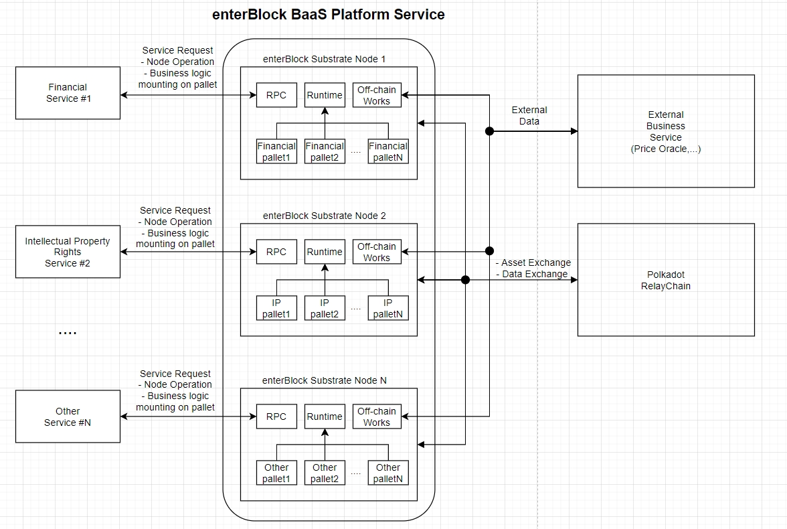

# enterBlock BaaS(Blockchain as a Service) Platform Service based on the Substrate

  

## Project Description
* Abstract
  * Our goal is to provide Substrate-based blockchains for users (mainly companies) to easily access.
We will provide APIs and documents basically so that they can be applied quickly and easily in applying blockchain to companies, and we will be able to easily exchange assets (tokens, copyrights, SCM information, etc.) in Polka dot chain.
We have already developed these projects through Parity, and we want to integrate them to develop them.

* Introduction
  * BaaS, which means blockchain as a service, can provide a blockchain service suitable for the environment even if the company preparing the blockchain service does not know blockchain technology. Compared with general nodes, the purpose of BaaS nodes is to quickly build the development environment that they mainly need, and provide various other services such as blockchain-based data inquiry, transaction transmission, and data analysis. It helps developers quickly validate their concepts and models. Even without a specialized blockchain development manpower, it is possible to construct a blockchain node with a few clicks and implement a smart contract, a core technology of the blockchain. Since there is no need to build a separate server, a company that wants to introduce a blockchain service can dramatically reduce the cost and time for service development.

## Team members 
* team leader
  * David Park : Ex-Bithumb coin(20+) wallet, sign server development & node operation guide. Samsung Galaxy S S-memo Development.
* team members
  * Mike MU : Blockchain researcher(Create a Blockchain research report 30+ 2) , DeFi Korea Co-Organizer, GrowFi Co-Founder, Korea Government Support Blockchain Education Instructor
  * Jay Lee : Coin(20+) wallet, sign server development & node operation guide @Bithumb Exchange. Mobile model leading & releasing team for USA market(AT/T, T-mobile) at LG MC.
  * Brian Noh : Defi Project full-stack Developer. (https://github.com/bannplayer/Growdrop/tree/master 3). Korea Government Support Blockchain Education Instructor.
  * Adonis Seo : Exchange service Front-end & Back-end development Bithumb Cryptocurreny Deposit/Withdraw development .
  * Ian Son : Bithumb new exchange system development, Coin/Token Management/Listing system development.
  * Kidori Park : Exchange web solution developer. Korea Government Support Blockchain Education Instructor.
  * Gami Wang : Exchange Product manager

## Team Website 
*   [https://www.linkedin.com/company/enterblock/](https://www.linkedin.com/company/enterblock/)
*   http://www.enterblock.co (TBD)

## Team's experience
* Bithumb CryptoCurrency Researcher. Node Operation Guide, wallet, Cold Wallet Management, wallet, smartcontract,deposit/withraw, exchange Matching engine Development
* UDTSwap : Automated token exchange using multiple liquidity pool economy building on Nervos
* Growdrop : Funding the revolution of blockchain ecosystem with DeFi
* Substrate Delivery Partners

## Team Code Repos
* Growdrop :https://github.com/GrowFi-labs/Growdrop
* UDTswap :https://github.com/GrowFi-labs/UDTswap
* Growfi labs :https://github.com/GrowFi-labs

## Team LinkedIn Profiles
* David Park :https://www.linkedin.com/in/%EA%B2%BD%EB%82%A8-%EB%B0%95-5a9805182/
* Jay Lee :https://www.linkedin.com/in/jay-lee-a24614aa/
* Mike MU :https://www.linkedin.com/in/mike-mu-a69160162/
* Jiamei Wang :https://www.linkedin.com/in/jiamei-wang-6b85791ab/
* Kiseok Park :https://www.linkedin.com/in/kiseok-park-722433177/
* Ian Son :https://www.linkedin.com/in/%EC%83%81%EC%9C%A4-%EC%86%90-39095ba3/
* Adonis Seo :https://www.linkedin.com/in/donghyuk-seo-0079a5131/
* Brian Noh :https://www.linkedin.com/in/sunglae-noh-533381196/

## Development Roadmap

For each milestone:
* Please be sure to include a specification of the software. The level of detail must be enough so that we are able to test that the software meets the specification.
* Please include total amount of funding requested per milestone. Funding can be in fiat (CHF, EUR or USD) or in DOTs. It can also be in a combination of fiat and DOTs. Please reach out to grants@web3.foundation (http://grants@web3.foundation/) to discuss what amount in fiat and DOTs would be appropriate for your project.
* Please note that we require documentation (e.g. tutorials) in each milestone. This ensures that the code can be widely used by the community.
* Please commit to providing a docker container for the delivery of your project. 
* Please indicate the number of Full-Time Employees working on each milestone, and include the number of days along with their cost per day.

### Milestone 1 — Implement Substrate Modules — 1 month — $33,000
*  Planning and Node configuration
  * Plan
    * We will first organize functions for users.
    * We will proceed with web page UI design to provide functions.
    * Interface composition and document creation that enterprise developers can easily develop
 * Node configuration
   * We will configure the node to check the basic functions.
   * Self-node configuration and testing
   * Build docker for testing

### Milestone 2 —  API implementation and testing— 1 month — $33,000
*  API
*  Node creation
*  Sendtransaction
*  Smart contracts (issuing smart contracts and tokens and NFTs)
*  Event management
*  Off-chain worker 
*  Web page production
  *   API document page production
  *   Create management page for users

### Milestone 3 — Operation and Testing — 1 month — $33,000

* Applied and tested for copyright registration and sales sites
   * [http://mvp.beatsomeone.com/beatsomeone/index]
   * Signed MOU with the company

## Future Plans
* Reference site extension and suggestion
  * Additional reference site extensions
* Proposal for Korean government project
  * Proposed to Korea's blockchain task system
