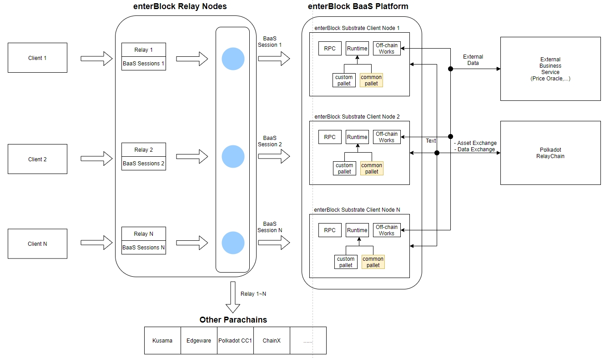

# enterBlock BaaS(Blockchain as a Service) Platform and Relay nodes Service

  

## Project Description
* Abstract
  * First goal : Providing Substrate-based blockchains(BaaS solutions) for users (mainly companies) to easily access.
  * Second goal : Many clients sometimes want to use our BaaS system as well as services related to many other parachains in the Polkadot ecosystem. In this situation, through the relay nodes that we operate, clients can easily use APIs without knowing the structure of many other parachains in the Polkadot ecosystem.
  
We will provide common APIs and documents basically so that they can be applied quickly and easily in applying blockchain to companies.
We have already developed these projects through Parity, and we want to integrate them to develop them.

* Introduction
  * BaaS, which means blockchain as a service, can provide a blockchain service suitable for the environment even if the company preparing the blockchain service does not know blockchain technology. Compared with general nodes, the purpose of BaaS nodes is to quickly build the development environment that companies mainly need, and provide various other services such as blockchain-based data inquiry, transaction transmission, and data analysis. It helps developers quickly validate their concepts and models. Even without a specialized blockchain development manpower, it is possible to construct blockchain nodes with a few clicks and implement smart contracts and core technologies of the blockchain. Since there is no need to build separate servers, companies that want to introduce a blockchain service can dramatically reduce the cost and time for service development. Currently, there are many service-type blockchain providers, and more companies are entering the market every year. In particular, there are some very reliable companies(Miscrosoft, Blockstream, Deloitte, Amazon and Dragonchain) that have already started offering these services to their customers. Unlike the above companies, enterBlock's enterprise-type BaaS utilizes Polkadot's interoperability, scalability, forkless future proof, and full security advantages to build blockchains based on the simple substrate framework in a matter of minutes. 

* Brief Explanation for the enterBlock BaaS Architecture
  * The enterprise block chain BaaS provided by enterBlock can provide various types of services as shown in the figure above. For example, if a general financial company wants to build a blockchain for their service operation, it can be easily built through our enterBlock platform. If they want to put their desired business logic on the blockchain, enterBlock can easily provide their desired logic in the form of API using pallets provided by substrate. Also, if you want to bring financial data from outside, you can easily meet their requirements by using offchain workers. Each blockchain in enterBlock can communicate with each other and exchange assets and data. The conclusion is that for each company, a blockchain suitable for the desired business logic is possible in enterBlock.
  
* Expectations
  * enterBlock's Blockchain-as-a-Service (BaaS) makes it easy for anyone from passionate startups and large enterprises to create blockchain applications. This is possible by creating a blockchain-based product and eliminating a lot of technical complexity. Most of the creation, implementation, and maintenance of an operational blockchain infrastructure no longer needs to be built from scratch. As banks and traditional financial institutions invest in blockchain with many companies in various industries, the chances of a blockchain provider as a service are very successful. BaaS services are particularly useful for startups that lack funds and talent, which are barriers to entry for blockchain innovation. Digital transformation is currently the biggest trend in the financial sector. In the current situation where tech fin companies are rapidly entering, financial sectors, including banks, will also be difficult to survive without disruptive innovation. Therefore, it is judged that traditional financial institutions, including banks, will utilize the blockchain provided by enterBlock, which can easily build and manage blockchains in financial services. On the basis of enterBlock BaaS, it is expected that the financial system can obtain an unprecedented cost reduction through blockchain. In the current centralized system, central security that stores all transaction records and personal information is very important. Financial fraudsters constantly develop all kinds of new technologies to paralyze this security system. So, financial companies are investing enormous costs in the technology to defend them. As e-commerce expands more and the Internet of Things (IoT) eras transactions between objects, costs are bound to rise. enterBlock is expected to grow as a breakthrough company in the enterprise-type BaaS market by solving the above problems for companies in preparation for such a market.

* enterBlock Projects in progress based on Substrate
  * GlueOS : It is a blockchain project that provides a development-friendly environment, and is a blockchain project focused on increasing developer convenience and providing the same user experience as a web and mobile environment. Therefore, general developers can easily participate in blockchain-based service development through glue.
    * https://www.glueos.com/
  * beat someone : As it is a copyright creation platform, anyone can easily trade their own creations.
    * http://mvp.beatsomeone.com/beatsomeone/index
    
* Team Experience
  * GlueOS explorer under development : http://121.133.140.199:4000/

## Team members 
* Team leader
  * David Park : Coin(20+) wallet, sign server development & node operation guide@Bithumb Exchange. Samsung Galaxy S S-memo Development.
* Team members
  * Mike MU : Blockchain researcher(Create a Blockchain research report 30+ 2) , DeFi Korea Co-Organizer, GrowFi Co-Founder, Korea Government Support Blockchain Education Instructor
  * Jay Lee : Coin(20+) wallet, sign server development & node operation guide @Bithumb Exchange. Mobile model leading & releasing team for USA market(AT/T, T-mobile) @LG MC.
  * Brian Noh : Defi Project full-stack Developer. (https://github.com/bannplayer/Growdrop/tree/master 3). Korea Government Support Blockchain Education Instructor.
  * Adonis Seo : Exchange service Front-end & Back-end development Bithumb Cryptocurreny Deposit/Withdraw development .
  * Ian Son : Bithumb new exchange system development, Coin/Token Management/Listing system development.
  * Kidori Park : Exchange web solution developer. Korea Government Support Blockchain Education Instructor.
  * Gami Wang : Exchange Product manager

## Team Website 
*   [https://www.linkedin.com/company/enterblock/](https://www.linkedin.com/company/enterblock/)
*   http://www.enterblock.co (TBD)

## Team's experience
* Bithumb CryptoCurrency Researcher. Node Operation Guide, wallet, Cold Wallet Management, wallet, smartcontract,deposit/withraw, exchange Matching engine Development
* UDTSwap : Automated token exchange using multiple liquidity pool economy building on Nervos
* Growdrop : Funding the revolution of blockchain ecosystem with DeFi
* Substrate Delivery Partners

## Team Code Repos
* Growdrop :https://github.com/GrowFi-labs/Growdrop
* UDTswap :https://github.com/GrowFi-labs/UDTswap
* Growfi labs :https://github.com/GrowFi-labs

## Team LinkedIn Profiles
* David Park :https://www.linkedin.com/in/%EA%B2%BD%EB%82%A8-%EB%B0%95-5a9805182/
* Jay Lee :https://www.linkedin.com/in/jay-lee-a24614aa/
* Mike MU :https://www.linkedin.com/in/mike-mu-a69160162/
* Jiamei Wang :https://www.linkedin.com/in/jiamei-wang-6b85791ab/
* Kiseok Park :https://www.linkedin.com/in/kiseok-park-722433177/
* Ian Son :https://www.linkedin.com/in/%EC%83%81%EC%9C%A4-%EC%86%90-39095ba3/
* Adonis Seo :https://www.linkedin.com/in/donghyuk-seo-0079a5131/
* Brian Noh :https://www.linkedin.com/in/sunglae-noh-533381196/

## Development Roadmap

For each milestone:
* Please be sure to include a specification of the software. The level of detail must be enough so that we are able to test that the software meets the specification.
* Please include total amount of funding requested per milestone. Funding can be in fiat (CHF, EUR or USD) or in DOTs. It can also be in a combination of fiat and DOTs. Please reach out to grants@web3.foundation (http://grants@web3.foundation/) to discuss what amount in fiat and DOTs would be appropriate for your project.
* Please note that we require documentation (e.g. tutorials) in each milestone. This ensures that the code can be widely used by the community.
* Please commit to providing a docker container for the delivery of your project. 
* Please indicate the number of Full-Time Employees working on each milestone, and include the number of days along with their cost per day.

### Milestone 1 — Implement Substrate Modules — 1 month — $33,000
*  Planning and Node configuration
  * Plan
    * We will first organize functions for users.
    * We will proceed with web page UI design to provide functions.
    * Interface composition and document creation that enterprise developers can easily develop
 * Node configuration
   * We will configure the node to check the basic functions.
   * Self-node configuration and testing
   * Build docker for testing

### Milestone 2 —  API implementation and testing— 1 month — $33,000
*  API
*  Node creation
*  Sendtransaction
*  Smart contracts (issuing smart contracts and tokens and NFTs)
*  Event management
*  Off-chain worker 
*  Web page production
  *   API document page production
  *   Create management page for users

### Milestone 3 — Operation and Testing — 1 month — $33,000

* MVP model for copyright registration and sales site for beatsomeone will be released
   * [http://mvp.beatsomeone.com/beatsomeone/index]
   
## Future Plans
* Reference site extension and suggestion
  * Additional reference site extensions
* Proposal for Korean government project
  * Proposed to Korea's blockchain task system
